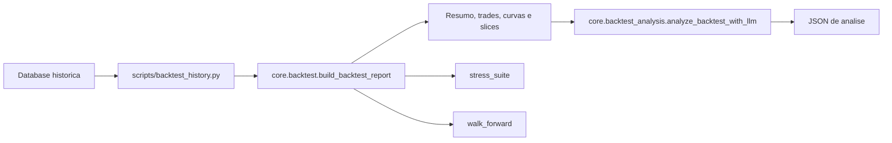

# Backtest e Analise LLM

Documentacao da implementacao de backtest deterministico, simulacao de execucao e analise operacional com LLM no `bot_polymarket`.

## Objetivo

O backtest foi criado para:

- validar `pair_15m` e `momentum_15m` com dados historicos persistidos;
- comparar estrategias, regimes e janelas temporais com metricas reproduziveis;
- simular custo de execucao para evitar resultados otimistas;
- usar LLM apenas como camada de analise pos-backtest, nao como arbitro do loop principal;
- gerar saida estruturada para dashboard, auditoria e experimentacao.

## Arquitetura

Fluxo principal:



Componentes:

- [C:\Projetos\bot_polymarket\scripts\backtest_history.py](C:\Projetos\bot_polymarket\scripts\backtest_history.py) orquestra leitura, filtros, stress, walk-forward e exportacao.
- [C:\Projetos\bot_polymarket\core\backtest.py](C:\Projetos\bot_polymarket\core\backtest.py) calcula equity, PnL, drawdown, Sharpe, trades, grouping por estrategia e por regime.
- [C:\Projetos\bot_polymarket\core\backtest_analysis.py](C:\Projetos\bot_polymarket\core\backtest_analysis.py) monta o prompt e converte a resposta LLM em JSON estrito.
- [C:\Projetos\bot_polymarket\core\app_context.py](C:\Projetos\bot_polymarket\core\app_context.py) fornece configuracao, banco, redis e runtime settings.

## O Que O Motor Mede

### Summary

O retorno principal do backtest traz:

- `initial_bankroll`
- `final_equity`
- `total_pnl`
- `realized_pnl`
- `max_drawdown`
- `sharpe_ratio`
- `points`
- `orders`
- `filled_orders`
- `fill_rate`
- `trade_count`
- `closed_trade_count`
- `open_trade_count`
- `win_rate`
- `avg_hold_minutes`
- `turnover_usd`
- `estimated_execution_cost_usd`
- `markets`

### Trade summary

Tambem sao calculados:

- `trades`
- `closed_trades`
- `winning_trades`
- `win_rate`
- `avg_hold_minutes`
- `median_hold_minutes`
- `realized_pnl_usd`

### Quebras por grupo

- `by_strategy`: agrega trades por `strategy_id`
- `by_regime`: agrega trades por `regime`
- `trades`: lista final de trades fechados e ainda abertos
- `points`: curva de equity ao longo do tempo

## Simulacao De Execucao

O backtest suporta uma camada simples de friccao operacional:

- `spread_bps`
- `slippage_bps`
- `latency_minutes`
- `latency_slippage_bps_per_minute`
- `partial_fill_fraction`
- `latency_fill_decay_per_minute`

Regras principais:

- ordens de entrada sofrem deslocamento adverso de preco;
- ordens de saida tambem sofrem deslocamento adverso;
- fill parcial reduz o tamanho efetivamente executado;
- latencia pode reduzir tanto o preco efetivo quanto a fracao executada;
- o resultado continua deterministico para os mesmos dados e parametros.

## Modos De Execucao

### Replay simples

Usado para reconstruir curva de equity e ordens simuladas sem a camada de stress.

```bash
python scripts/replay_history.py --hours 24 --export-json .tmp/replay.json
```

### Backtest deterministico

Usado para o fluxo principal de validacao historica.

```bash
python scripts/backtest_history.py --hours 24 --walk-forward-slices 3 --export-json .tmp/backtest.json
```

### Backtest com stress

Adiciona cenarios conservadores de spread, latencia e liquidez.

```bash
python scripts/backtest_history.py --hours 24 --stress-suite --export-json .tmp/backtest-stress.json
```

### Backtest com LLM

Adiciona a camada de analise pos-backtest.

```bash
python scripts/backtest_history.py --hours 24 --llm-analysis --export-json .tmp/backtest-llm.json
```

## CLI

Arquivo:

- [C:\Projetos\bot_polymarket\scripts\backtest_history.py](C:\Projetos\bot_polymarket\scripts\backtest_history.py)

Opcoes principais:

| Opcao | Descricao |
|---|---|
| `--hours` | Janela de retrospeto quando `--start` nao e informada |
| `--start` | Inicio da janela em ISO-8601 |
| `--end` | Fim da janela em ISO-8601 |
| `--market-id` | Restringe a um market_id |
| `--asset` | Restringe a um ativo, como `BTC` |
| `--tier` | Restringe a um tier, como `btc` ou `major` |
| `--strategy` | Restringe a uma estrategia, como `pair_15m` |
| `--regime` | Restringe a um regime, como `trend` |
| `--limit` | Limite maximo de snapshots e ordens lidos |
| `--walk-forward-slices` | Numero de fatias sequenciais para validacao |
| `--stress-suite` | Executa os cenarios conservadores de execucao |
| `--llm-analysis` | Executa a analise LLM apos o backtest |
| `--llm-agent` | Nome do agente configurado para a analise |
| `--export-json` | Caminho para exportar o relatorio completo |
| `--export-csv` | Caminho para exportar a curva base em CSV |

## Estrutura Da Saida

O JSON exportado contem:

- `window`
- `reports`
- `walk_forward`
- `analysis`

Exemplo resumido:

```json
{
  "window": {
    "start_at": "2026-04-01T00:00:00+00:00",
    "end_at": "2026-04-02T00:00:00+00:00",
    "strategy": "momentum_15m"
  },
  "reports": {
    "baseline": {
      "summary": {},
      "trade_summary": {},
      "by_strategy": [],
      "by_regime": [],
      "trades": [],
      "points": []
    }
  },
  "walk_forward": [],
  "analysis": null
}
```

## Analise LLM

Arquivo:

- [C:\Projetos\bot_polymarket\core\backtest_analysis.py](C:\Projetos\bot_polymarket\core\backtest_analysis.py)

O prompt da analise:

- recebe o report do backtest;
- seleciona trades fechados;
- destaca maiores perdas e maiores ganhos;
- inclui `summary`, `trade_summary`, `by_strategy` e `by_regime`;
- exige JSON estrito como resposta.

Campos esperados da analise:

- `verdict`
- `confidence`
- `strengths`
- `failure_modes`
- `regime_notes`
- `operational_rules`
- `recommended_experiments`
- `promotion_decision`

Se a chamada LLM falhar:

- o backtest continua;
- a analise retorna `analysis_failed`;
- o erro e sanitizado em `error`;
- o custo fica zerado;
- o loop deterministico nao e interrompido.

## Parametros De Stress

Os cenarios atuais sao definidos em [C:\Projetos\bot_polymarket\scripts\backtest_history.py](C:\Projetos\bot_polymarket\scripts\backtest_history.py):

- `stress_spread`
- `stress_latency`
- `stress_liquidity`

Esses cenarios aplicam:

- spread maior;
- slippage maior;
- latencia maior;
- fill parcial menor;
- decaimento de fill por minuto de latencia.

## Walk-Forward

O backtest divide a janela em slices sequenciais quando `--walk-forward-slices > 1`.

Uso esperado:

- comparar performance entre slices;
- detectar dependencia excessiva de um unico subperiodo;
- reduzir risco de overfitting;
- observar se a estrategia mantem consistencia entre regimes.

## Estrategias Cobertas

### `momentum_15m`

O backtest serve para validar:

- filtro de edge minimo;
- confianca minima do sinal;
- aderencia a regimes de tendencia;
- efeito do risco por regime em [C:\Projetos\bot_polymarket\core\risk_engine.py](C:\Projetos\bot_polymarket\core\risk_engine.py).

### `pair_15m`

O backtest serve para validar:

- reducao de churn;
- cooldown por sinal;
- seletividade de entrada;
- tamanho dinamico da posicao;
- sensibilidade a custo de execucao.

## Validacoes Ja Adicionadas

Cobertura automatica:

- [C:\Projetos\bot_polymarket\tests\test_backtest.py](C:\Projetos\bot_polymarket\tests\test_backtest.py)
- [C:\Projetos\bot_polymarket\tests\test_backtest_analysis.py](C:\Projetos\bot_polymarket\tests\test_backtest_analysis.py)
- [C:\Projetos\bot_polymarket\tests\test_backtest_history.py](C:\Projetos\bot_polymarket\tests\test_backtest_history.py)

O que essas validacoes cobrem:

- calculo do report do backtest;
- parse do JSON da analise LLM;
- criacao do diretorio de export;
- integracao entre CLI e exportacao.

## Como Interpretar O Resultado

Leitura rapida:

- `final_equity` e `total_pnl` indicam retorno bruto;
- `max_drawdown` indica quanto a curva sofreu;
- `win_rate` sozinho nao basta;
- `avg_hold_minutes` ajuda a entender churn;
- `turnover_usd` e `estimated_execution_cost_usd` mostram quanto o custo pesa;
- `by_strategy` e `by_regime` revelam onde o edge vive.

Criterios praticos:

- promover mudanca apenas quando o ganho aparece em mais de uma janela;
- rejeitar ajuste que dependa de poucos trades;
- desconfiar de lucro que some no stress;
- usar o LLM para explicar, nao para substituir a evidencia do backtest.

## Operacao Na VPS

O fluxo mais comum no container `api` e:

```bash
docker compose -f docker-compose.prod.yml exec -T api python scripts/backtest_history.py --hours 336 --strategy momentum_15m --walk-forward-slices 3 --stress-suite --llm-analysis --export-json .tmp/backtest-momentum.json
```

Observacao:

- o caminho de export e criado automaticamente;
- o JSON pode ser salvo em `.tmp/` dentro do container;
- a analise LLM depende do runtime configurado em `AppContext`.

## Referencias Diretas

- [C:\Projetos\bot_polymarket\core\backtest.py](C:\Projetos\bot_polymarket\core\backtest.py)
- [C:\Projetos\bot_polymarket\core\backtest_analysis.py](C:\Projetos\bot_polymarket\core\backtest_analysis.py)
- [C:\Projetos\bot_polymarket\scripts\backtest_history.py](C:\Projetos\bot_polymarket\scripts\backtest_history.py)
- [C:\Projetos\bot_polymarket\docs\MAINTENANCE.md](C:\Projetos\bot_polymarket\docs\MAINTENANCE.md)
